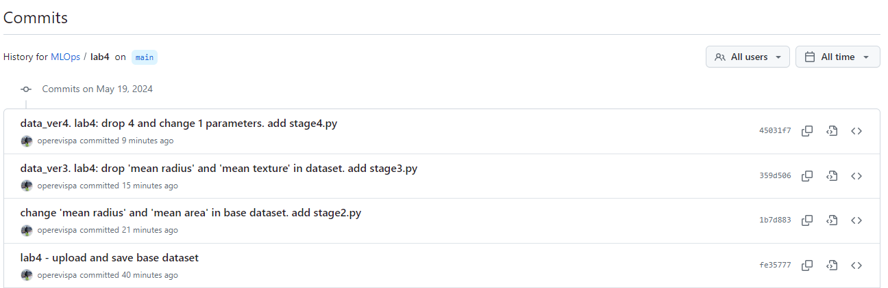
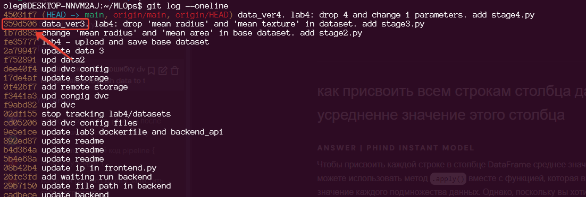

# MLOps. Практическое задание №4
## Использование dvc для версионирования данных
Пример реализации версионирования датасетов с использованием связки gitHub и утилиты dvc (data version control)
Реализовано 4 стадии работы с датасетом:
- на стадии 1 загружается датасет "Рак груди" и сохраняется без изменений в папку datasets. 
- на стадии 2 в датасете меняются две переменные (mean radius принимает среднее значение, а mean area принимает максимальное значение)
- на стадии 3 из измененного на предыдущей стадии датасета удаляются два параетра: "mean radius", "mean texture"
- на стадии 4 из измененного на предыдущей стадии датасета удаляются еще 4 параметра ("mean perimeter", "mean area", "mean smoothness", "mean compactness") и 1 изменяется ("mean concavity" принимает минимальное значение)
На каждой стадии внутри скрипта загружается актуальный датасет, производится изменения, после чего датасет сохраняется в той же место и с тем же названием. После этого вызывается следующая очередность команд:
 ```
 dvc add
 dvc push
 git add <new script.py>
 git add lab4/datasets.dvc
 git commit -m "comment about stage"
 git push origin main
 ```
В качестве удаленного хранилища используется Google Drive.
Всего было 4 коммита, связанных с изменением датасетов. Начиная с 3 коммита, в комментариях указывал версию датасета (надо было бы с самого начала применять такую практику - весьма удобно)



## Удаление и возвращение датасета
На практике проведено тестирование удаления актуального датасета и загрузка его актуальной версии и ранее сохраненной. 
Загрузка актуальной версии производится командой `dvc pull`
Загрузка датасета версии 3 производится путем переключения на соответствующий коммит и скачиванием файлов
```
 git log --oneline
 git checkout 359d506
 dvc pull
 ```
 Аналогичным образом происходит переключение на более ранние версии датасетов (с указанием в команде git chekout нужного id коммита). Для упрощения навигации между датасетами следует использовать корректные комментарии в коммитах на гитах, с указанием версии датасета (а также пайплайна, версии кода и тп).
 


