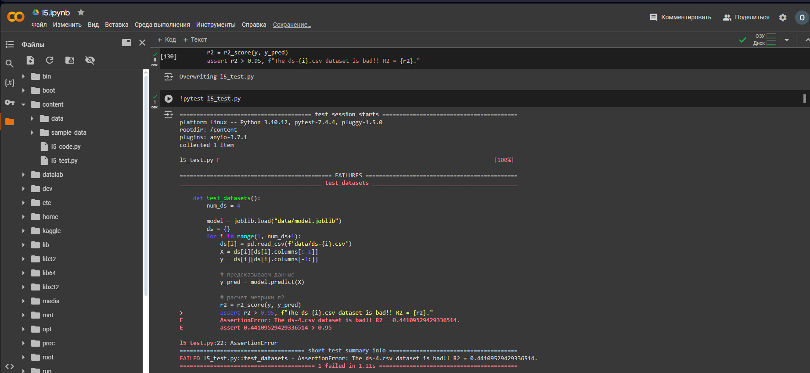

# MLOps. Практическое задание №5
## Написание тестов на pytest
Подготолен jupiter ноутбук, в котором реализован функционал создания датасетов и обучение модели в одной ячейке кода. Данный код выгружается в отдельный python скрипт (`l5_code.py`). После этого внутри ноутбука вызывает исполнение данного скрипта. 

Отдельной ячейкой ноутбука описан код осуществляющий тестирование модели (данный код также выгружается из ноутбука в скрипт `l5_test.py`) и после этого файл запускается на исполнение.

**Подробнее:**
В рамках скрипта `l5_code.py` создаются 4 синтетических датасета (тематика "оценка кредитного потенциала заемщика"), 3 из которых качественные, а один с выбросами. На одном из качественных датасетов происходит обучение модели линейной регрессии. По итогам обучения модель выдает r2_score более 0.99. Однако на некачественном датасете r2_score не наблюдался выше 0.6.

В рамках скрипта `l5_test.py` реализована загрузка датасетов и модели из файлов, и далее проводится тестирование каждого датасета. Если r2_score ниже 0.95 выдается ошибка и указывается название файла с некачественным датасетом. 

Тестирование вне jupiter ноубука осуществляется запуском команды `pytest l5_test.py`, после запуска основного скрипта командой `python l5_code.py`.

## Файлы
- [l5.ipynb](l5.ipynb) - jupiter ноутбук с кодом создания датасетов и обучения модели, а также тестирования качества модели на созданных датасетах
- [l5_code.py](l5_code.py) - python файл с кодом создания датасетов и обучения модели
- [l5_test.py](l5_test.py) - python файл с кодом тестов качества обучения модели
